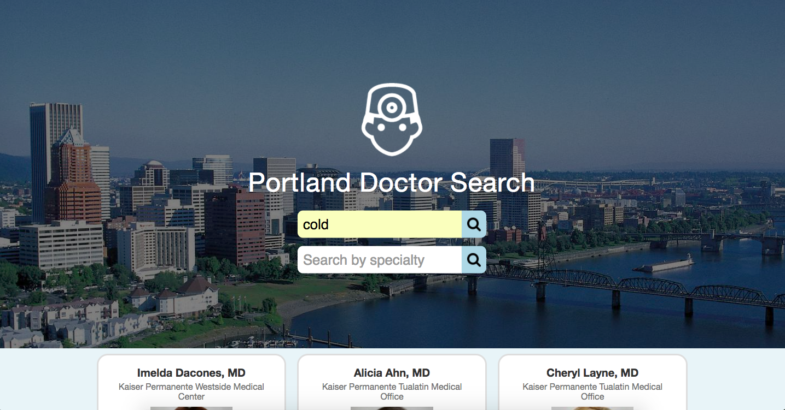

# Portland Doctor search

### By Maxwell Cady

## 01.06.2017

## Description
 A website where users may enter a medical issue (ie: “toothache”) into a form, submit it, and receive a list of doctors they may seek out to help with their medical issue. The site can also be used to list doctor's in the Portland area with a specific specialty.

## Technologies Used
* jQuery
* Sass
* normalize.css
* gulp
* NodeJS
* Bower
* BetterDoctor API

## Setup Instructions
Clone repository and run 'npm install' and 'bower install'. Then run 'npm serve'. API Key can be obtained from https://developer.betterdoctor.com/ and signing up. Once the API key is obtained, create a .env file exporting the API key as the variable 'apiKey' in the root directory. After .env is created, run gulp build and open index.html.

## License
GPL 2017
